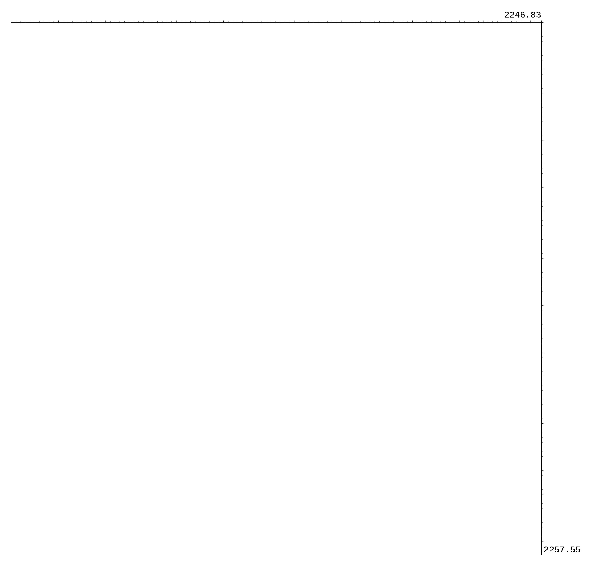
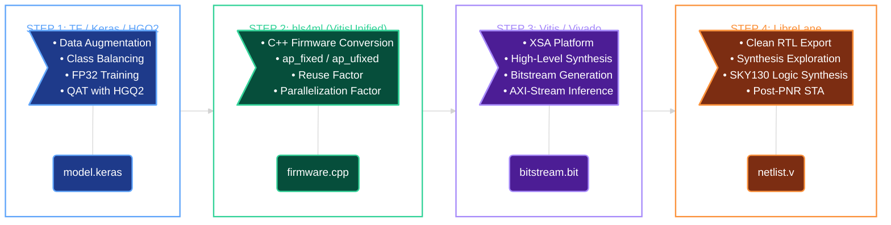
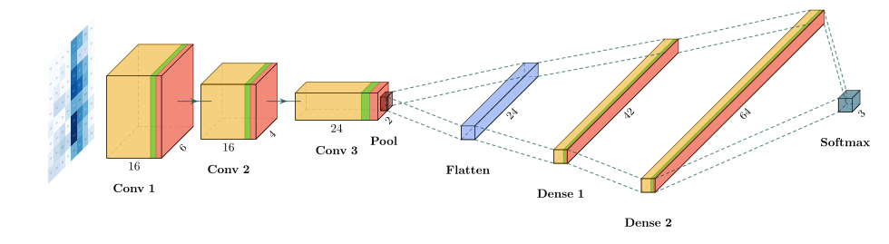
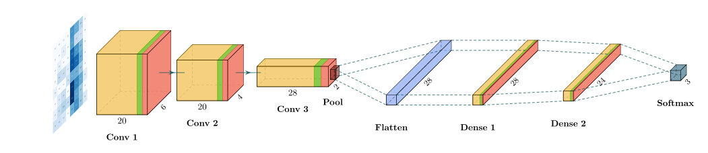
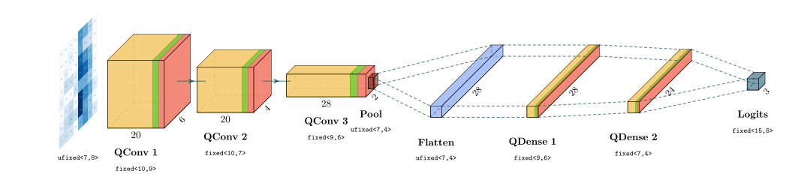
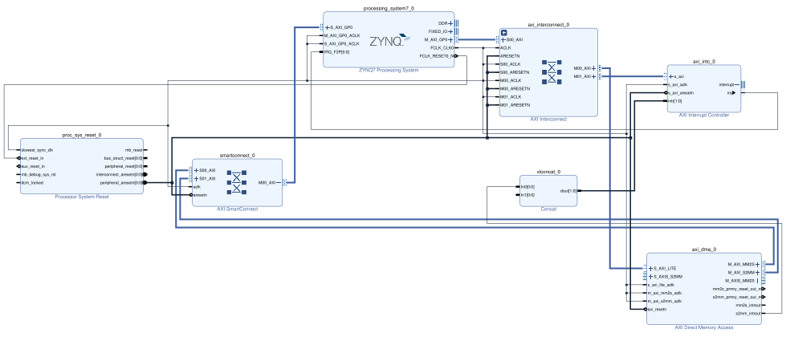
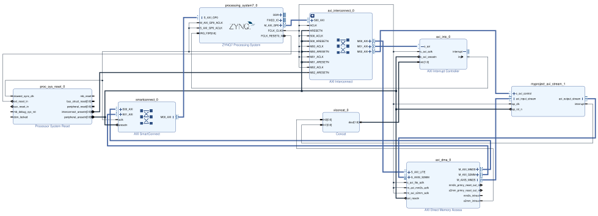
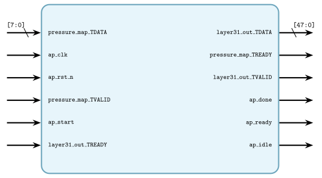
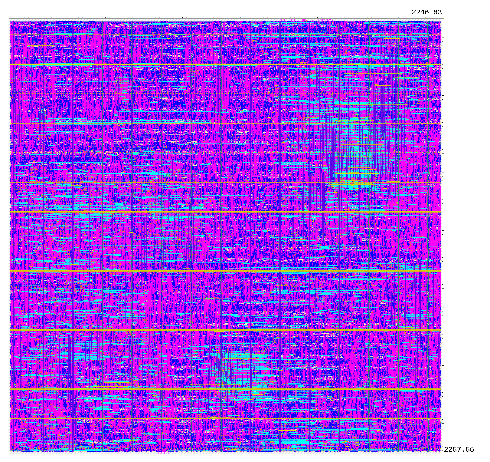

<div align="center">
<h1>BedPosIP</h1>
</div>

<!-- GitHub Badges Section -->
<p align="center">
  <a href="https://www.python.org/">
    
  </a>
  <a href="https://keras.io/">
    
  </a>
  <a href="https://www.tensorflow.org/">
    
  </a>
  <a href="https://fastmachinelearning.org/hls4ml/">
    
  </a>
  <a href="https://www.amd.com/en/products/software/adaptive-socs-and-fpgas/vitis.html">
    
  </a>
  <a href="https://fossi-foundation.org/librelane">
    
  </a>
  <a href="https://github.com/google/skywater-pdk">
    
  </a>
  <a href="https://www.apache.org/licenses/LICENSE-2.0">
    
  </a>
  <br />
</p>

<!-- Description -->
<p align="center">
    
    <br>
    <b>Quantized CNN accelerator for patient bed-posture classification, from ML model to ASIC</b><br>
    <i>with <code>HGQ2</code> quantization-aware training, <code>hls4ml</code> code translation, <code>PYNQ-Z2</code> FPGA prototyping<br>
    and synthesized with <code>SkyWater 130nm</code> technology via <code>LibreLane</code>.</i>
</p>

## Methodology

The project follows a four-stage flow [[1](#ref-lane2025)]. Each stage consumes the artifact produced by the previous one, so the design can be stopped, inspected or re-targeted at any boundary.



## Project Structure

```
bedposip/
├── pipeline/                                
│   ├── 01_data_augmentation.ipynb           # Augmentation stages
│   ├── 02_data_preparation.ipynb            # Dataset Preparation
│   ├── 03_train_base_cnn.ipynb              # FP32 baseline + KerasTuner search
│   ├── 04_train_quantized_cnn.ipynb         # HGQ2 QAT
│   ├── 05_gen_bitstream.ipynb               # hls4ml VitisUnified
│   ├── 06_infer_bitstream.ipynb             # PYNQ-Z2 Inference
│   ├── 07_export_ip.ipynb                   # hls4ml Vitis
│   ├── config.json                          # LibreLane design
│   ├── constraint.sdc                       # SDC timing constraints
│   └── input/
│       ├── DatosEntrenamiento.csv           # 192 raw samples
│       └── platform/
│           └── pynq-z2.xsa                  # Board platform for the FPGA flow
│
├── src/bedposip/                            # Installable Python package
│
├── tests/
│   └── test_augmentation.py                 # Unit tests for the augmentation core
│
├── figures/                                 # Assets used by this README
│
├── pyproject.toml                           # Package metadata, deps
├── uv.lock                                  
└── .python-version                          # 3.13
```

### Generated at Runtime

None of the following is tracked by git, each is produced by running the notebooks in order.

```
pipeline/
├── output/
│   ├── posture_classifier_base.keras        # Step 03 — FP32 baseline
│   ├── posture_classifier_tuned.keras       # Step 03 — tuned FP32
│   ├── posture_classifier_qat.keras         # Step 04 — quantized
│   ├── gen_bitstream/                       # Step 05 — VitisUnified build
│   │   └── export/                          
│   │       ├── system.bit                   # Step 06 — ALL 3 FILES BELOW MUST BE COPIED TO THE PYNQ-Z2
│   │       ├── system.hwh                   
│   │       └── axi_stream_driver.py         
│   │
│   └── export_ip/                           # Step 07 — Vitis build
│
├── rtl/                                     # Step 07 — generated .v files
├── runs/                                    # Step 08 — LibreLane runs
└── figures/                                 # Training curves, confusion matrices
```

## Installation

> **Python version:** `>=3.13,<3.14`

```bash
uv sync
source .venv/bin/activate
```

`uv` manages the environment and `pyproject.toml` declares the project dependencies, including the **hls4ml fork** [[2](#ref-jeison-hls4ml)] used for the FPGA flow.

> **Note:** the `bedposip` package must be importable before running any notebook, since every notebook imports from `bedposip`.

### GPU Support Setup: TensorFlow CUDA from pip packages

When installing `tensorflow[and-cuda]`, the CUDA libraries are delivered as separate `nvidia-*` pip packages inside the virtual environment. TensorFlow's dynamic linker does **not** automatically discover these `.so` files because `LD_LIBRARY_PATH` is empty by default, so `tf.config.list_physical_devices('GPU')` returns an empty list even though a GPU is present.

**Solution:** patch `.venv/bin/activate` so that activation automatically appends every `lib/` directory from the `nvidia-*` pip packages to `LD_LIBRARY_PATH`.

First, add the restore block **inside** the `deactivate()` function, right after the `_OLD_VIRTUAL_PYTHONHOME` restoration:

```bash
    if ! [ -z "${_OLD_LD_LIBRARY_PATH+_}" ] ; then
        LD_LIBRARY_PATH="$_OLD_LD_LIBRARY_PATH"
        export LD_LIBRARY_PATH
        unset _OLD_LD_LIBRARY_PATH
    fi
```

Then add the collection block **after** the `VIRTUAL_ENV_PROMPT` export and **before** the `pydoc` alias section:

```bash
# Add NVIDIA CUDA libraries from pip packages to LD_LIBRARY_PATH
_OLD_LD_LIBRARY_PATH="${LD_LIBRARY_PATH-}"
CUDA_LIBS=""
for libdir in "$VIRTUAL_ENV"/lib/python*/site-packages/nvidia/*/lib; do
    if [ -d "$libdir" ]; then
        if [ -z "$CUDA_LIBS" ]; then
            CUDA_LIBS="$libdir"
        else
            CUDA_LIBS="$CUDA_LIBS:$libdir"
        fi
    fi
done
if [ -n "$CUDA_LIBS" ]; then
    if [ -n "${_OLD_LD_LIBRARY_PATH}" ]; then
        LD_LIBRARY_PATH="$CUDA_LIBS:$_OLD_LD_LIBRARY_PATH"
    else
        LD_LIBRARY_PATH="$CUDA_LIBS"
    fi
    export LD_LIBRARY_PATH
fi
```

Re-activate and verify:

```bash
source .venv/bin/activate
python -c "import tensorflow as tf; print(tf.config.list_physical_devices('GPU'))"
```

Training is CPU-capable, but QAT (step 04) is strongly GPU-recommended.

## Toolchain Prerequisites

Steps 05, 07, and 08 require AMD and open-source EDA tooling that is **not** installed by `uv`.

| Tool | Version | Needed for |
| :--- | :--- | :--- |
| Vitis / Vivado | **2023.2** | Steps 05, 07 — HLS synthesis, bitstream, utilization reports ([install guide](https://www.amd.com/en/support/downloads/adaptive-socs-and-fpgas/development-tools/2023-2.html)) |
| PYNQ-Z2 board files | — | Step 05 — supplied via the tracked `pipeline/input/platform/pynq-z2.xsa` ([tutorial](https://github.com/Tanawin1701d/vitis_unified_backend_tutorial/tree/master/platform_setup_tutorial)) |
| LibreLane | recent | Step 08 — ASIC synthesis, place & route, STA, Final GDSII via Nix ([install guide](https://librelane.readthedocs.io/en/latest/installation/nix_installation/index.html)) |

Notebook `05` and `07` load Vitis into `PATH` from inside the notebook, so **edit the `script` variable** in the *Conversion* cell to match your installation:

```python
script = "/home/jeison/AMD/Vitis/2023.2/settings64.sh"
```

Without this, `hls_model.build()` fails because the backend cannot find `vitis_hls`.

### LaTeX for Figures

Notebooks 02–07 render every figure through LaTeX:

```python
plt.rcParams.update(
    {
        "text.usetex": True,
        "font.family": "Computer Modern Serif",
    }
)
```

`text.usetex=True` shells out to a real LaTeX installation, so **TeX must be installed on the machine** or those cells raise. Install a distribution with the Computer Modern fonts.

Debian/Ubuntu

```bash
sudo apt install texlive-latex-recommended texlive-fonts-recommended dvipng
```

Arch

```bash
sudo pacman -Syu texlive-latexrecommended texlive-fontsrecommended dvipng
```

> If you have no TeX and do not need publication-quality figures, set `"text.usetex": False` in the affected notebooks, since nothing else in the pipeline depends on it.

## Dataset

The raw dataset is `pipeline/input/DatosEntrenamiento.csv`, where each sample is an 8x8 pressure map.

<div align="center">

| POSICION  | Samples |
| :-------: | :-----: |
| trunk_L   |      34 |
| trunk_R   |      32 |
| fetus_R   |      32 |
| prone     |      32 |
| fetus_L   |      31 |
| supine    |      31 |
| **Total** | 192     |

</div>

> **Source:** The bed-posture dataset (`DatosEntrenamiento.csv`) was collected in a previous project under Justin Bueno [[3](#ref-bueno2022)] — [LinkedIn](https://www.linkedin.com/in/justin-bueno-d/).

## Pipeline

Run the notebooks **in order**, each with the working directory set to `pipeline/`. Steps 01–04 are CPU/GPU only, step 05 needs Vitis, step 06 runs on the board, step 07 needs Vitis and step 08 needs LibreLane.

### 1.  Data Augmentation — `01_data_augmentation.ipynb`

Three independent stages, spatial translation, per-cell KDE generation, and translation of the generated data, then class balancing to 50 000 samples per class, producing the balanced CSV consumed by the next step.

### 2.  Data Preparation — `02_data_preparation.ipynb`

Stratified 40/20/40 split, the 6 → 3 class merge, and export of the six `.npy` arrays that every later notebook loads through `load_dataset()`.

### 3.  Base CNN Training — `03_train_base_cnn.ipynb`

A Keras 3 FP32 baseline establishing the accuracy ceiling the quantized model is measured against. This architecture was adapted from the _SVHN classifier_ found in [[4](#ref-arrestad2021)].

<p align="center">
    
    <br>
    <i>Base FP32 architecture</i>
</p>

<p align="center">
    
    <br>
    <i>Tuned FP32 CNN architecture</i>
</p>

### 4.  Quantization-Aware Training — `04_train_quantized_cnn.ipynb`

HGQ2 quantize the Keras layers while keeping the spatial topology identical to the FP32 baseline, so the two stay directly comparable. No softmax is used, the output layer emits raw logits [[5](#ref-hgq2)].

<p align="center">
    
    <br>
    <i>Quantized CNN architecture</i>
</p>

### 5.  FPGA Bitstream Generation — `05_gen_bitstream.ipynb`

The `VitisUnified` backend synthesizes, implements and packages the whole design in one call, emitting the bitstream, the utilization reports and the board driver together.

The generated accelerator is placed into a Zynq-7000 platform alongside an AXI DMA, following the tutorial of the `VitisUnified` backend [[6](#ref-tanawin-vitisunified)].

<p align="center">
    
    <br>
    <i>Platform baseline</i>
    <br><br>
    
    <br>
    <i>The same design plus <code>myproject_axi_stream_1</code> bound to the DMA streams</i>
</p>

<p align="center">
    
    <br>
    <i>IP Diagram with axi-stream interface generated by Vitis HLS</i>
</p>

**All three `export/` artifacts (`system.bit`, `system.hwh` and `axi_stream_driver.py`) must be copied to the PYNQ-Z2 board**, and the `.bit`/`.hwh` pair must share the same basename or PYNQ cannot bind the overlay. The driver is generated by the backend and is not part of the repository.

### 6.  On-Board Inference — `06_infer_bitstream.ipynb`

**This notebook runs on the PYNQ-Z2 board, not on the workstation.** The bitstream, the `.hwh` and the generated driver are copied to the board, where the overlay is loaded and the test set is classified in batches. **BATCH** must stay under the **20480-bit** DMA transfer limit. The hardware returns raw logits, so the prediction need a function like argmax.

### 7.  RTL Export for ASIC — `07_export_ip.ipynb`

The same quantized model is re-converted with the plain `Vitis` backend [[7](#ref-fastml-hls4ml)] and built, yielding synthesisable Verilog files in `pipeline/rtl/`. This step produces the clean RTL required for the ASIC flow, no bitstream is generated.

### 8.  ASIC Synthesis & PNR — LibreLane

The ASIC implementation uses LibreLane [[8](#ref-librelane)] with the SkyWater 130nm PDK [[9](#ref-google-skywater)]. This step is **manual** (no notebook) and must be run after step 07 completes. See [Toolchain Prerequisites](#toolchain-prerequisites).

**Run commands:**

```bash
cd pipeline/
nix-shell ~/librelane/shell.nix
librelane config.json
```

The **Classic** flow uses `pipeline/config.json` and `pipeline/constraint.sdc` for timing constraints.

<p align="center">
    
    <br>
    <i>Final GDSII render of the AREA 1 strategy</i>
</p>

## Reproducibility

Every notebook fixes randomness explicitly:

```python
np.random.seed(42)
keras.utils.set_random_seed(42)
```

## References

<a id="ref-lane2025"></a>
[1] D. M. Lane and A. Sahafi, "ADNA: Automating Application-Specific Integrated Circuit Development of Neural Network Accelerators," *Electronics*, vol. 14, no. 7, art. 1432, 2025, doi: 10.3390/electronics14071432. [https://www.mdpi.com/2079-9292/14/7/1432](https://www.mdpi.com/2079-9292/14/7/1432)

<a id="ref-jeison-hls4ml"></a>
[2] Jeison-HM, "hls4ml — VitisUnifiedClean branch," GitHub. [https://github.com/Jeison-HM/hls4ml/tree/VitisUnifiedClean](https://github.com/Jeison-HM/hls4ml/tree/VitisUnifiedClean)

<a id="ref-bueno2022"></a>
[3] J. E. Bueno Díaz, "Prototipo Funcional de Sistema para Detección y Monitoreo de Áreas Susceptibles a Úlceras por Decúbito mediante Sensores de Presión Textiles," Proyecto de Grado, Pontificia Universidad Católica Madre y Maestra, 2022.

<a id="ref-arrestad2021"></a>
[4] T. Aarrestad et al., "Fast convolutional neural networks on FPGAs with hls4ml," arXiv:2101.05108v2, 2021. [https://arxiv.org/abs/2101.05108v2](https://arxiv.org/abs/2101.05108v2)

<a id="ref-hgq2"></a>
[5] FastML Team, "HGQ2 — hardware-generative quantization," GitHub, 2024. [https://github.com/fastmachinelearning/hgq2](https://github.com/fastmachinelearning/hgq2)

<a id="ref-tanawin-vitisunified"></a>
[6] Tanawin1701d, "hls4ml at VitisUnifiedClean," GitHub. [https://github.com/Tanawin1701d/hls4ml/tree/VitisUnifiedClean](https://github.com/Tanawin1701d/hls4ml/tree/VitisUnifiedClean)

<a id="ref-fastml-hls4ml"></a>
[7] FastML Team, "hls4ml," 2024. [https://github.com/fastmachinelearning/hls4ml](https://github.com/fastmachinelearning/hls4ml)

<a id="ref-librelane"></a>
[8] LibreLane contributors, "LibreLane," FOSSi Foundation. [https://github.com/librelane/librelane](https://github.com/librelane/librelane)

<a id="ref-google-skywater"></a>
[9] Google, "SkyWater130nm open-source process design kit." [https://github.com/google/skywater-pdk](https://github.com/google/skywater-pdk)